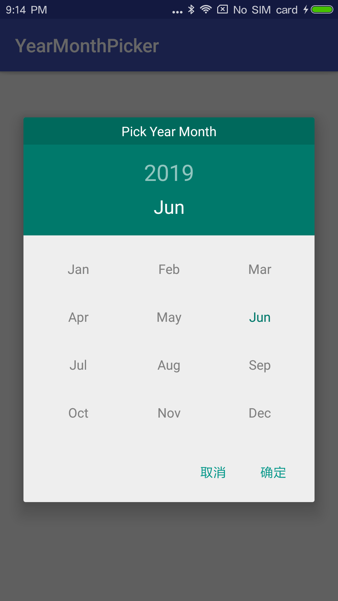
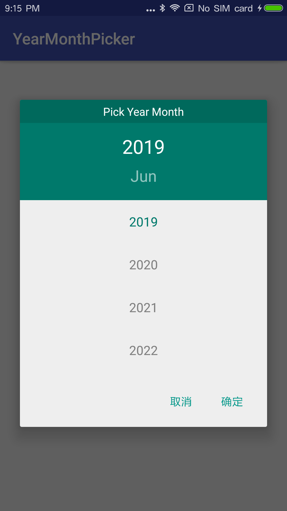
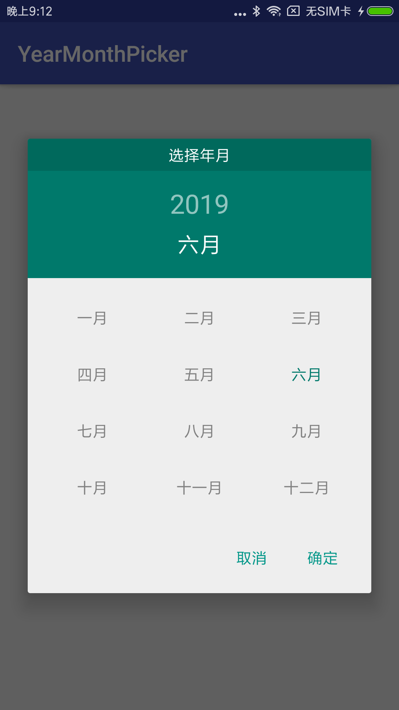
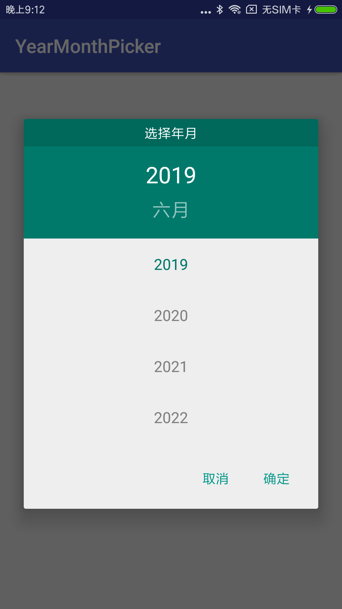

## TYYDateTimePicker

TYYDateTimePicker is a library of new year and month picker for Android,
supporting API level 14 and up.

## YearAndMonthPicker



## Installation
This library depends on the `appcompat-v7`, `design`, and `gridlayout-v7` support libraries.
It is recommended that you exclude them from the library and add those dependencies on your own.
This will ensure both your project and this library are using the same versions of the support
libraries.


### jcenter
```groovy
    //Step 1. Add the JitPack repository to your build file
    // Add it in your root build.gradle at the end of repositories:
    allprojects {
		repositories {
			...
			maven { url 'https://jitpack.io' }
		}
	}

    //Step 2. Add the dependency
    dependencies {
        implementation 'com.github.ShuaiTod:DateTimePicker:0.1.1'
	}
```

### maven
```groovy
    //Step 1. Add the JitPack repository to your build file
    <repositories>
		<repository>
		    <id>jitpack.io</id>
		    <url>https://jitpack.io</url>
		</repository>
	</repositories>

    //Step 2. Add the dependency
    <dependency>
	    <groupId>com.github.ShuaiTod</groupId>
	    <artifactId>DateTimePicker</artifactId>
	    <version>0.1.1</version>
	</dependency>
```

## Usage

### Create Pickers

```java
    TYYYearMonthPickerDialog yyYearMonthPicker = new TYYYearMonthPickerDialog(this, new TYYYearMonthPickerDialog.OnYearMonthSetListener(){
        @Override
        public void onYearMonthSet(TYYYearMonthPickerDialog view, int year, int month) {
            mYear = year;
            mMonth = month;
            ((TextView)findViewById(R.id.tv_name)).setText(Integer.toString(mYear) + "Year" + Integer.toString(month + 1) + "Month");
        }

    }, mYear, mMonth);
    yyYearMonthPicker.show();
```